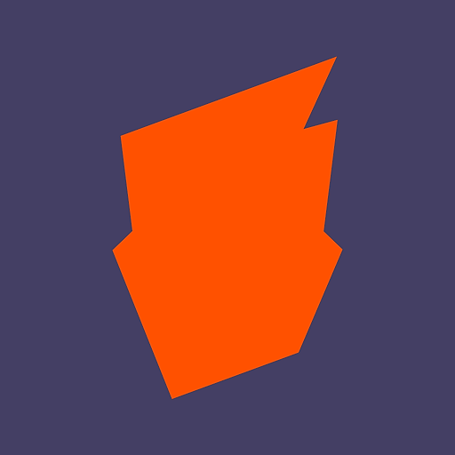

<a id="readme-top"></a>


<!-- PROJECT SHIELDS -->
[![Contributors][contributors-shield]][contributors-url]
[![Issues][issues-shield]][issues-url]
[![Stargazers][stars-shield]][stars-url]
[![LinkedIn][linkedin-shield]][linkedin-url]


<!-- PROJECT TITLE -->
<br />
<div align="center">
  <a href="https://boardgamegeek.com/">
    
  </a>
  
<h3 align="center">BoardGameGeek API Project</h3>

  <p align="center">
    A Flask-based web application that allows users to search for board games using the BoardGameGeek (BGG) API and manage a personal collection of games.
    <br />
    <a href="https://github.com/jonho29/bgg_project"><strong>Explore the docs »</strong></a>
    <br />
    <br />
    <a href="https://github.com/jonho29/bgg_project">View Demo</a>
  </p>
</div>


<!-- TABLE OF CONTENTS -->
<details>
  <summary>Table of Contents</summary>
  <ol>
    <li>
      <a href="#about-the-project">About The Project</a>
      <ul>
        <li><a href="#built-with">Built With</a></li>
      </ul>
    </li>
    <li>
      <a href="#getting-started">Getting Started</a>
      <ul>
        <li><a href="#prerequisites">Prerequisites</a></li>
        <li><a href="#running-the-app-with-docker-compose">Running the App (with Docker Compose)</a></li>
        <li><a href="#running-the-app-with-docker">Running the App (with Docker)</a></li>
      </ul>
    </li>
    <li><a href="#usage">Usage</a></li>
    <li><a href="#roadmap">Roadmap</a></li>
    <li><a href="#contributing">Contributing</a></li>
    <li><a href="#contact">Contact</a></li>
    <li><a href="#acknowledgments">Acknowledgments</a></li>
  </ol>
</details>


<!-- ABOUT THE PROJECT -->
## About The Project

There are a ton of great board game tracking apps/websites/services that essentially provide the same functionalities (and more), but I wanted to take a stab at creating my own.  This project is a web application for searching, viewing, and managing a personal board game collection using data from BGG.  The app allows users to search for board games, view detailed information, and maintain their own game collection via a user-friendly web interface.

#### Main Features:
* Game Search (via BGG API):
    * Users can search for board games by name, which queries the BGG API and desplays matching results.
    * Users can get detailed game info by game ID, including name, image, description, year published, player counts, suggested player counts, categories, and mechanics.
* Game Collection Management:
    * Users can add games to their personal collection, which is stored using a SQL database (via SQLAlchemy).
    * The collection view displays detailed information for each stored game, such as player counts, suggested numbers, categories, and mechanics.
    * Games can be deleted from the collection through the UI.
* Web UI:
    * The web interface includes pages for searching games, viewing search results, viewing the collection, and detailed views for individual games.
    * Templates are rendered using Jinja2, and static assets (like JavaScript) enable dynamic interactions (such as deleting games).

> **Note:**
> This will be an ongoing project that will continue to evolve as I practice and expand my coding skills.  Expect updates and new features as I experiment with different programming techniques, frameworks, and modern development best practices.

<p align="right">(<a href="#readme-top">back to top</a>)</p>


### Built With

* [![Python][Python.org]][Python-url]
* [![Flask][Flask.py]][Flask-url]
* [![SQLAlchemy][SQLAlchemy.org]][SQLAlchemy-url]
* [![Jinja2][Jinja2.py]][Jinja2-url]
* [![HTML][HTML5]][HTML-url]
* [![JavaScript][JavaScript.com]][JavaScript-url]

<p align="right">(<a href="#readme-top">back to top</a>)</p>


<!-- GETTING STARTED -->
## Getting Started

To get a local copy up and running follow these simple example steps.

### Prerequisites

To avoid downloading the project dependencies locally, download Docker before proceeding with the following steps.
* [Docker](https://www.docker.com/get-started/)

### Running the App (with Docker Compose)

_Below is an example of how to get the application up and running locally (with Docker Compose)._

1. Clone the repo
   ```sh
   git clone https://github.com/jonho29/bgg_project.git
   ```
2. Build and run application
   ```sh
   docker compose up
   ```
3. Open up a web browser and go to `https://localhost:4000/`

### Running the App (with Docker)

_Below is an example of how to get the application up and running locally (with Docker)._

1. Clone the repo
   ```sh
   git clone https://github.com/jonho29/bgg_project.git
   ```
2. Build the Docker image
   ```sh
   docker build . -t bgg_project
   ```
3. Run the Docker image
   ```sh
   docker run -p 4000:4000 bgg_project:latest
   ```
4. Open up a web browser and go to `https://localhost:4000/`

<p align="right">(<a href="#readme-top">back to top</a>)</p>


<!-- USAGE EXAMPLES -->
## Usage

* User visits the home page and searches for a game.
* The app queries BGG, parses the XML, and shows a table of found games.
* Clicking a game shows more details and allows the user to add it to their collection.
* The collection page lists all saved games with detailed attributes, and users can remove games as needed.

> **TODO:**
> Get screenshots and stuff of how to use the website.

<p align="right">(<a href="#readme-top">back to top</a>)</p>


<!-- ROADMAP -->
## Roadmap

- [x] bgg.py
    - [x] Pull and handle BGG API XML data
    - [x] Ratings
- [ ] Web application
    - [x] Search functionality
    - [x] Add games to collection
    - [x] Remove from collection
    - [x] Ratings
    - [ ] Notes
- [x] Pipenv
- [x] Dockerize
- [ ] Pipenv --> Poetry
- [ ] Make application accessible on a different IP
    - [ ] Update app.run() function with the host parameter
- [ ] AWS Migration
    - [ ] S3
    - [ ] CloudFront - HTTPS for security
    - [ ] Route 53 - DNS
    - [ ] RDS


See the [open issues](https://github.com/jonho29/bgg_project/issues) for a full list of proposed features (and known issues).

<p align="right">(<a href="#readme-top">back to top</a>)</p>


<!-- CONTRIBUTING -->
## Contributing

Contributions are what make the open source community such an amazing place to learn, inspire, and create. Any contributions you make are **greatly appreciated**.

If you have a suggestion that would make this better, please fork the repo and create a pull request.
Don't forget to give the project a star! Thanks again!

1. Fork the Project
2. Create your Feature Branch (`git checkout -b feature/AmazingFeature`)
3. Commit your Changes (`git commit -m 'Add some AmazingFeature'`)
4. Push to the Branch (`git push origin feature/AmazingFeature`)
5. Open a Pull Request

<p align="right">(<a href="#readme-top">back to top</a>)</p>

### Top contributors:

<a href="https://github.com/jonho29/bgg_project/graphs/contributors">
  
</a>


<!-- CONTACT -->
## Contact

Jonathan Ho - 29jjhhoo@gmail.com - https://www.linkedin.com/in/jonathan-ho29/

Project Link: [https://github.com/jonho29/bgg_project](https://github.com/jonho29/bgg_project)

<p align="right">(<a href="#readme-top">back to top</a>)</p>


<!-- ACKNOWLEDGMENTS -->
## Acknowledgments

* [BoardGameGeek](https://boardgamegeek.com/)
* [BGG API How-to Guide](https://www.tayloraliss.com/bggapi/index.html)
* [BGG XMLAPI2](https://boardgamegeek.com/xmlapi2)
* [BGG XMLAPI2 Wiki](https://boardgamegeek.com/wiki/page/BGG_XML_API2)

<p align="right">(<a href="#readme-top">back to top</a>)</p>


<!-- MARKDOWN LINKS & IMAGES -->
<!-- https://www.markdownguide.org/basic-syntax/#reference-style-links -->
[contributors-shield]: https://img.shields.io/github/contributors/jonho29/bgg_project.svg?style=for-the-badge
[contributors-url]: https://github.com/jonho29/bgg_project/graphs/contributors
[issues-shield]: https://img.shields.io/github/issues/github_username/repo_name.svg?style=for-the-badge
[issues-url]: https://github.com/jonho29/bgg_project/issues
[stars-shield]: https://img.shields.io/github/stars/github_username/repo_name.svg?style=for-the-badge
[stars-url]: https://github.com/jonho29/bgg_project/stargazers
[linkedin-shield]: https://img.shields.io/badge/-LinkedIn-black.svg?style=for-the-badge&logo=linkedin&colorB=555
[linkedin-url]: https://www.linkedin.com/in/jonathan-ho29/
[product-screenshot]: images/screenshot.png
[Python.org]: https://img.shields.io/badge/python-3670A0?style=for-the-badge&logo=python&logoColor=ffdd54
[Python-url]: https://www.python.org/
[Flask.py]: https://img.shields.io/badge/Flask-000000?style=for-the-badge&logo=Flask&logoColor=white
[Flask-url]: https://flask.palletsprojects.com/en/stable/
[SQLAlchemy.org]: https://img.shields.io/badge/sqlalchemy-D71F00?style=for-the-badge&logo=sqlalchemy&logoColor=white
[SQLAlchemy-url]: https://www.sqlalchemy.org/
[Jinja2.py]: https://img.shields.io/badge/jinja2-white.svg?style=for-the-badge&logo=jinja&logoColor=black
[Jinja2-url]: https://jinja.palletsprojects.com/en/stable/
[HTML5]: https://img.shields.io/badge/html-%23E34F26.svg?style=for-the-badge&logo=html5&logoColor=white
[HTML-url]: https://svelte.dev/
[JavaScript.com]: https://img.shields.io/badge/javascript-%23323330.svg?style=for-the-badge&logo=javascript&logoColor=%23F7DF1E
[Javascript-url]: https://www.javascript.com/
